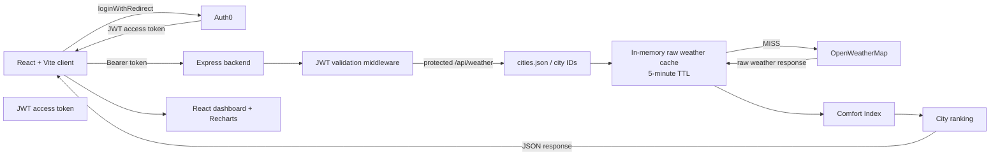

# Fidenz Weather Analytics

## Overview

Fidenz Weather Analytics is a React and Express application that retrieves current weather conditions for a configured list of cities, calculates a custom Comfort Index, ranks cities by that score, and presents the results in an authenticated dashboard.

The system is designed to make cross-city weather comparison quick and readable. It uses OpenWeatherMap for current conditions, an in-memory five-minute cache to reduce repeated upstream requests, and Auth0 access tokens to protect weather analytics requests.

## Features

- Auth0 login and logout flow in the React client.
- Protected weather analytics dashboard.
- Current weather retrieval for the city IDs in `cities.json`.
- Five-minute in-memory cache for raw OpenWeatherMap responses.
- Partial-failure handling with `Promise.allSettled()` so one failed city does not discard every successful result.
- Custom Comfort Index using temperature, humidity, wind speed, and cloudiness.
- City ranking from highest to lowest Comfort Score.
- Dashboard search and sorting by Comfort Score, temperature, humidity, or rank.
- Responsive city cards showing current weather values and scores.
- Recharts temperature-by-city bar chart.
- Persistent light/dark mode toggle using local storage and the system preference as a fallback.
- Health and cache-status endpoints.
- Server-side tests for the Comfort Index and cache behavior.
- Helmet security headers and CORS configuration.

## Technology Stack

| Area | Technology |
| --- | --- |
| Frontend | React 19, Vite, React DOM |
| Frontend authentication | `@auth0/auth0-react` |
| Visualization | Recharts |
| Backend | Node.js, Express 5 |
| Weather API | OpenWeatherMap Current Weather API via Axios |
| Backend authentication | `express-oauth2-jwt-bearer` |
| Security and transport | Helmet, CORS, dotenv |
| Testing | Vitest |
| Test dependency | Supertest is installed, but no current test imports or uses it |
| Linting | Oxlint on the client |

Tailwind CSS is not installed or configured. The current UI uses the custom CSS in `client/src/index.css`.

## Architecture



### Request flow

1. `Auth0Provider` initializes the React application. An unauthenticated user can sign in with `loginWithRedirect()`.
2. The protected dashboard requests an access token with the configured Auth0 audience.
3. The client sends that token as `Authorization: Bearer <token>` to `GET /api/weather`.
4. Express applies `express-oauth2-jwt-bearer` validation to the weather route.
5. The controller extracts city-code values from `cities.json`, converts them with `Number`, and requests each city with `Promise.allSettled()`.
6. The weather service checks the raw-response cache before calling OpenWeatherMap.
7. Successful weather data is validated, scored, ranked, and returned to the client.
8. The dashboard renders summary metrics, city cards, search/sort controls, and the temperature chart.

## Project Structure

```text
.
├── cities.json
├── client/
│   ├── package.json
│   ├── vite.config.js
│   └── src/
│       ├── App.jsx
│       ├── main.jsx
│       ├── index.css
│       ├── auth/ProtectedRoute.jsx
│       ├── components/
│       │   ├── CityCard.jsx
│       │   ├── ErrorState.jsx
│       │   ├── LoadingState.jsx
│       │   ├── LoginButton.jsx
│       │   ├── LogoutButton.jsx
│       │   └── WeatherChart.jsx
│       ├── pages/
│       │   ├── Dashboard.jsx
│       │   └── Home.jsx
│       └── services/weatherApi.js
└── server/
    ├── package.json
    └── src/
        ├── app.js
        ├── server.js
        ├── config/env.js
        ├── controllers/weatherController.js
        ├── middleware/authMiddleware.js
        ├── routes/cacheRoutes.js
        ├── routes/weatherRoutes.js
        ├── services/cacheService.js
        ├── services/comfortService.js
        ├── services/weatherService.js
        ├── tests/cache.test.js
        ├── tests/comfort.test.js
        └── utils/
            ├── cities.js
            └── ranking.js
```

## Prerequisites

- Node.js with npm.
- An Auth0 application configured for the React client.
- An Auth0 API/audience configured for the backend.
- An OpenWeatherMap API key.
- A browser that can complete the Auth0 redirect flow.

There is no root `package.json`, root workspace script, `.env.example`, or environment template in the repository.

## Installation

Install dependencies separately for the two applications:

```bash
cd server
npm install

cd ../client
npm install
```

The available package scripts are:

| Directory | Command | Purpose |
| --- | --- | --- |
| `server` | `npm run dev` | Start the API with Nodemon |
| `server` | `npm start` | Start the API with Node |
| `server` | `npm test` | Run Vitest once |
| `server` | `npm run test:watch` | Run Vitest in watch mode |
| `server` | `npm run test:coverage` | Run Vitest with coverage |
| `client` | `npm run dev` | Start the Vite development server |
| `client` | `npm run build` | Create a production client build |
| `client` | `npm run preview` | Preview the production client build |
| `client` | `npm run lint` | Run Oxlint |

## Environment Variables

No environment files are committed. Create local environment files for each application and use placeholders for secrets.

### Backend

The backend reads variables with `dotenv` from the server process environment.

| Variable | Required by code | Purpose |
| --- | --- | --- |
| `PORT` | No | API port; defaults to `5000` |
| `CLIENT_ORIGIN` | Yes | Allowed CORS origin |
| `OPENWEATHER_API_KEY` | Yes | OpenWeatherMap API key |
| `AUTH0_DOMAIN` | Used by JWT middleware | Auth0 domain, without the protocol |
| `AUTH0_AUDIENCE` | Used by JWT middleware | Auth0 API audience |

Example placeholders only:

```env
PORT=5000
CLIENT_ORIGIN=http://localhost:5173
OPENWEATHER_API_KEY=your_openweathermap_api_key
AUTH0_DOMAIN=your-tenant-region.auth0.com
AUTH0_AUDIENCE=https://your-api-audience
```

`AUTH0_DOMAIN` and `AUTH0_AUDIENCE` are read by the authentication middleware but are not included in the startup-required list in `config/env.js`. The weather route still depends on them for JWT validation.

### Frontend

Vite exposes the following variables through `import.meta.env`:

| Variable | Purpose |
| --- | --- |
| `VITE_AUTH0_DOMAIN` | Auth0 tenant domain for `Auth0Provider` |
| `VITE_AUTH0_CLIENT_ID` | Auth0 SPA client ID |
| `VITE_AUTH0_AUDIENCE` | Audience requested for access tokens |
| `VITE_API_URL` | Base API URL used by the weather service |

Example placeholders only:

```env
VITE_AUTH0_DOMAIN=your-tenant-region.auth0.com
VITE_AUTH0_CLIENT_ID=your_auth0_client_id
VITE_AUTH0_AUDIENCE=https://your-api-audience
VITE_API_URL=http://localhost:5000/api
```

Never place an Auth0 client secret, password, JWT, or real OpenWeatherMap key in this README or in frontend source.

## Running the Application

Start the backend in one terminal:

```bash
cd server
npm run dev
```

Start the frontend in another terminal:

```bash
cd client
npm run dev
```

The Vite development server prints its local URL. The backend defaults to `http://localhost:5000` when `PORT` is not set.

## City Code Processing

`cities.json` contains a top-level `List` array. Each item includes a `CityCode`, `CityName`, `Temp`, and `Status` field. The backend currently uses only `CityCode` for OpenWeatherMap requests.

`server/src/utils/cities.js`:

1. Reads the repository-level `cities.json` file.
2. Parses the JSON and validates that `List` is an array.
3. Extracts `CityCode` values, removes falsy values, and converts the remaining values with `Number`.
4. Throws an error when fewer than 10 city codes are available.

The supplied file contains 10 city entries, so it satisfies the current minimum requirement. The utility validates the `List` container and count, but does not explicitly reject non-numeric results from `Number()`. The supplied codes are numeric. The `Temp` and `Status` values in the file are not used as the live weather response; current values come from OpenWeatherMap.

## OpenWeatherMap Integration

The weather service requests the OpenWeatherMap Current Weather endpoint:

```text
https://api.openweathermap.org/data/2.5/weather
```

Each request uses:

- The city ID as the `id` query parameter.
- `OPENWEATHER_API_KEY` as the `appid` query parameter.
- `units=metric` for Celsius and metric wind speed.
- A 10-second Axios timeout.

The controller validates that the response includes numeric temperature, humidity, wind speed, and cloudiness values. Failed requests and invalid responses are collected in `failedCities`, while valid cities continue through scoring and ranking. The response includes `count`, `failedCount`, `updatedAt`, `cities`, and `failedCities`.

## Comfort Index Formula

The current implementation is a custom heuristic based on four weather inputs. It is not a scientific or medical comfort standard.

Ideal values and weights:

| Component | Ideal value | Weight |
| --- | ---: | ---: |
| Temperature | `24°C` | `40%` |
| Humidity | `50%` | `30%` |
| Wind speed | `3 m/s` | `20%` |
| Cloudiness | `30%` | `10%` |

Each component is clamped to the range `0` to `100`:

```text
Temperature Score = clamp(100 - |temperature - 24| × 5)
Humidity Score    = clamp(100 - |humidity - 50| × 2)
Wind Score        = clamp(100 - |windSpeed - 3| × 20)
Cloudiness Score  = clamp(100 - |cloudiness - 30| × 2)
```

The final score is:

```text
Final Score =
  Temperature Score × 0.40
  + Humidity Score × 0.30
  + Wind Score × 0.20
  + Cloudiness Score × 0.10
```

The source code gives temperature the greatest influence, followed by humidity, wind, and cloudiness. In product terms, this makes temperature and moisture the dominant signals while still allowing wind and cloud cover to affect the result. These are implementation choices for this assignment, not validated scientific weights.

The returned score and component scores are rounded to two decimal places. Because every component is clamped before weighting and the weights sum to `1.00`, the final score is constrained to `0–100`; the tests also verify this range for extreme input.

Visibility is returned in each city object when OpenWeatherMap provides it, but it is not part of the current Comfort Index formula.

## City Ranking

`server/src/utils/ranking.js` creates a copy of the valid city list, sorts it by `comfortScore` descending, and assigns `rank` values from `1` in sorted order. The highest Comfort Score receives rank `1`.

Ranks are sequential and unique. There is no explicit tie-breaker and no shared-rank behavior. When scores tie, the current JavaScript runtime's stable sort preserves the input order, which is derived from the city-code order and the settled-result iteration order.

The dashboard can display this ranking order or apply client-side sorting by score, temperature, humidity, or rank after the API response has been received.

## Caching Design

The raw weather cache is implemented with an in-memory JavaScript `Map` in `server/src/services/cacheService.js`.

- City ID is normalized to a string and used as the map key.
- The cached value is the raw OpenWeatherMap response.
- Each entry stores `createdAt`, `expiresAt`, and `data`.
- The TTL is five minutes (`300` seconds).
- A valid entry is a cache `HIT`.
- A missing or expired entry is a cache `MISS`.
- Expired entries are removed when they are read through `getCachedWeather`; the status endpoint can still report an expired map entry as `EXPIRED` until a normal cache read removes it.
- Hit and miss counters are process-local.

Raw weather is cached instead of processed Comfort Index results so the current formula can be recalculated from the same raw conditions without making another upstream request. This also keeps the cache independent from the presentation and scoring layer.

### `GET /api/cache/status`

This endpoint returns cache statistics and does not currently use the JWT middleware:

- `ttlSeconds`: configured TTL in seconds.
- `entries`: number of current map entries.
- `hits`: number of valid cache reads.
- `misses`: number of cache misses, including expired entries.
- `cities`: per-city status with `cityId`, `status`, and `expiresInSeconds`.

## Authentication

The frontend wraps the application with `Auth0Provider` in `client/src/main.jsx`. It uses:

- `VITE_AUTH0_DOMAIN` for the tenant domain.
- `VITE_AUTH0_CLIENT_ID` for the SPA client.
- `VITE_AUTH0_AUDIENCE` when requesting an access token.
- `loginWithRedirect()` for login.
- `logout()` with the current origin as the return URL.
- `getAccessTokenSilently()` before requesting weather data.

`ProtectedRoute` uses `withAuthenticationRequired` around the dashboard. The unauthenticated home page remains public, while the dashboard is rendered only for authenticated users.

## Authorization

The backend weather route uses `express-oauth2-jwt-bearer` with:

- Issuer base URL: `https://${AUTH0_DOMAIN}`.
- Audience: `AUTH0_AUDIENCE`.

`GET /api/weather` is protected by this middleware. The health endpoint and cache-status endpoint are not protected by the current route definitions.

Requests without a valid access token are rejected by the JWT middleware before the weather controller runs. There is no whitelist implementation or Auth0 Post Login Action in this repository. If the assignment requires allow-listing, it must be configured in Auth0 separately and documented as external configuration. The assignment test user email is `careers@fidenz.com`; no password is documented here.

The repository does not configure public signup behavior. Whether signup is enabled or disabled is controlled by Auth0 Dashboard settings and cannot be verified from this source tree.

## MFA

Email verification and multi-factor authentication are different controls. Verifying an email address does not itself enable MFA.

The repository contains no Auth0 MFA configuration, Action, or application setting. MFA therefore cannot be claimed as implemented in code. To use MFA for the assignment, it must be enabled and configured in the Auth0 Dashboard, using the required Auth0 policy and enrolled factor. The exact factor and policy are deployment configuration rather than behavior represented in this repository.

## Security

Implemented security measures include:

- Auth0 access-token validation for the weather API.
- Auth0-managed authentication in the React client.
- `Authorization: Bearer` token forwarding for weather requests.
- JWT issuer and audience validation through `express-oauth2-jwt-bearer`.
- Helmet middleware for security-related HTTP headers.
- CORS restricted to the configured `CLIENT_ORIGIN`.
- OpenWeatherMap and Auth0 server settings loaded from environment variables.
- No API key or client secret embedded in source code.
- Validation of required weather fields before scoring.
- A 10-second timeout for OpenWeatherMap requests.

The cache-status endpoint is currently public, and the repository does not include rate limiting, persistent secret storage, or a database.

## API Endpoints

### `GET /api/health`

| Property | Value |
| --- | --- |
| Authentication | None |
| Purpose | Confirm that the API process is responding |

Example response:

```json
{
  "status": "ok",
  "service": "fidenz-weather-api",
  "timestamp": "2026-01-01T00:00:00.000Z"
}
```

### `GET /api/weather`

| Property | Value |
| --- | --- |
| Authentication | Required; valid Auth0 JWT access token |
| Purpose | Retrieve current weather, Comfort Index values, and city rankings |

Example response shape:

```json
{
  "success": true,
  "count": 1,
  "failedCount": 0,
  "updatedAt": "2026-01-01T00:00:00.000Z",
  "cities": [
    {
      "cityId": 123456,
      "cityName": "Example City",
      "country": "EX",
      "weatherDescription": "clear sky",
      "temperature": 24,
      "humidity": 50,
      "windSpeed": 3,
      "cloudiness": 30,
      "pressure": 1012,
      "visibility": 10000,
      "comfortScore": 100,
      "comfortComponents": {
        "temperature": 100,
        "humidity": 100,
        "wind": 100,
        "cloudiness": 100
      },
      "cacheStatus": "MISS",
      "rank": 1
    }
  ],
  "failedCities": []
}
```

### `GET /api/cache/status`

| Property | Value |
| --- | --- |
| Authentication | None in the current implementation |
| Purpose | Inspect in-memory cache TTL, entries, hit count, miss count, and per-city status |

Example response shape:

```json
{
  "success": true,
  "cache": {
    "ttlSeconds": 300,
    "entries": 1,
    "hits": 2,
    "misses": 1,
    "cities": [
      {
        "cityId": 123456,
        "status": "HIT",
        "expiresInSeconds": 295
      }
    ]
  }
}
```

## Frontend Dashboard

The dashboard is implemented in `client/src/pages/Dashboard.jsx` and includes:

- Responsive summary metrics for tracked cities, average comfort, and average temperature.
- Search by city name.
- Client-side sorting by Comfort Score, temperature, humidity, or rank.
- City cards with rank, Comfort Score, description, temperature, humidity, wind, and cloudiness.
- Loading and error states.
- Empty search-result state.
- A Recharts bar chart comparing temperature by city.
- In-page navigation between city rankings and the chart.
- Authenticated user email and logout control.

The public home page is implemented in `client/src/pages/Home.jsx`. It provides the sign-in call to action and explains the dashboard workflow before authentication.

## Testing

The server package uses Vitest. Current tests are:

- `server/src/tests/comfort.test.js`: verifies ideal conditions produce a score of `100` and scores remain between `0` and `100`.
- `server/src/tests/cache.test.js`: verifies cache misses, cache hits, cache data retrieval, and cache statistics.

Run the implemented tests with:

```bash
cd server
npm test
```

`Supertest` is present in `server/package.json`, but there are currently no Supertest-based API tests. There are currently no ranking tests or endpoint integration tests in the repository. The client has an Oxlint script but no client test suite.

## Design Decisions and Trade-offs

### In-memory `Map` vs Redis

The in-memory `Map` is simple, dependency-light, and sufficient for the current assignment. It is process-local, so it is not shared between server instances and is cleared on restart. Redis would provide shared state, persistence options, and better multi-instance behavior, but would add operational infrastructure.

### Raw weather cache vs processed cache

The application caches raw provider responses and calculates the Comfort Index during request processing. This keeps scoring logic easy to change and avoids storing presentation-specific results. The trade-off is that scoring work is repeated for each request.

### `Promise.allSettled()` vs `Promise.all()`

`Promise.allSettled()` allows the controller to return all successful city results while reporting failed cities separately. `Promise.all()` would reject the whole batch when a single upstream request fails.

### No database for the current assignment scope

The current application reads a fixed city list and serves current conditions. It has no users, historical records, or application-owned persisted data that require a database, so an in-memory cache and JSON configuration file keep the implementation focused.

## Live Coding Extension

Visibility is not part of the current Comfort Index formula. It is available in the city response and can be added as a separate live-coding extension during the recording.

A proposed extension is:

```text
Temperature = 35%
Humidity = 25%
Wind = 15%
Cloudiness = 10%
Visibility = 15%

Visibility Score = clamp((visibility / 10000) × 100)
```

With the current raw-weather caching design, the formula can be changed and applied immediately to cached raw weather on the next request; it does not require waiting for the five-minute raw cache entry to expire.

This visibility formula and weighting are proposed for the live coding exercise only. They are not implemented in the current repository.

## Known Limitations

- The in-memory cache is process-local and disappears on restart.
- The application depends on the availability, response shape, and rate limits of OpenWeatherMap.
- The Comfort Index represents current conditions only and is a custom heuristic.
- No historical weather data is stored.
- No database is used.
- Cache status is exposed without authentication.
- Auth0 MFA and allow-list configuration are not represented in repository code.
- No API integration tests or ranking tests are currently present.
- Vite reports a large client bundle because Recharts and the application are currently emitted in the main bundle.
- Auth0 signup, whitelist/Post Login Actions, email verification, and MFA settings cannot be verified from repository code.

## Bonus Features

Implemented bonus-style capabilities include:

- Responsive dashboard and public home page.
- Search and sorting controls.
- Temperature visualization with Recharts.
- Persistent light/dark mode toggle.
- Server-side Comfort Index and cache unit tests.

## Git Workflow

The inspected repository is currently on branch `feature/dashboard`. Recent commits include:

- `54b4e7e` — implement Home component with navigation and weather signals display.
- `7366620` — enhance Dashboard layout and component structure.
- `d006716` — add and integrate `WeatherChart`.
- `a648ef8` — add `CityCard`, `ErrorState`, and `LoadingState`.
- `c0a19d1` — refactor the authentication flow in `App`.
- `ebb4e83` — add the authenticated weather API client.
- `a941a23` — add the protected route.
- `941ae4b` — add the logout button.

This README does not create branches, commits, or pull requests.

## Submission Checklist

- [ ] Weather data retrieved from OpenWeatherMap.
- [ ] City codes read and validated from `cities.json`.
- [ ] Minimum 10-city requirement enforced.
- [ ] Comfort Index implemented with the current four-component formula.
- [ ] City ranking implemented by descending Comfort Score.
- [ ] Five-minute raw weather cache implemented.
- [ ] Responsive UI implemented.
- [ ] Auth0 login, logout, and protected dashboard configured.
- [ ] MFA enabled in Auth0 Dashboard and verified separately from email verification.
- [ ] Auth0 whitelist/Post Login Action configured if required by the assignment.
- [ ] Server Comfort Index and cache tests passing.
- [ ] README completed.
- [ ] Helmet, CORS, JWT validation, and environment-based secret management reviewed.
- [ ] Recording completed for the required live coding extension.
- [ ] GitHub reviewer access granted to:
  - [ ] `kanishka.d@fidenz.com`
  - [ ] `srimal.w@fidenz.com`
  - [ ] `narada.a@fidenz.com`
  - [ ] `amindu.l@fidenz.com`
  - [ ] `niroshanan.s@fidenz.com`

## Future Improvements

- Replace the process-local cache with Redis.
- Add historical weather storage and trend analysis.
- Add a database for configurable cities, saved views, and user preferences.
- Expand analytics beyond current temperature comparison.
- Evaluate more sophisticated comfort models against user or domain research.
- Add structured monitoring, request metrics, and upstream failure alerts.
- Add API integration and ranking tests.
- Add production deployment configuration and secure secret management.
